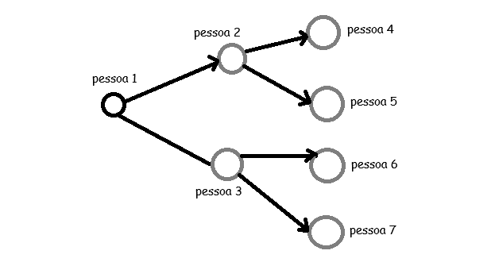

### Introdução

Inicialmente, precisamos dar uma introdução a um problema e depois falarmos sobre o que é um grafo em si.

Imagine que se tenha um ponto inicial na cidade e um destino final, para alcançar esse destino final você tem várias rotas e precisa escolher o caminho com a menor deslocamento possível, esse tipo de problema é chamado de "problema do caminho mínimo" e o algoritmo de resolução dele chama-se "pesquisa em largura".

Para utilizar esse algoritmo precisamos modelar o problema usando "grafos".

### O que é um grafo ?

O modelo de um grafo é um conjunto de conexões, você pode associar pessoas umas com as outras e gerar uma conexão que pode ser expressa em forma de grafos, que seria dado por "vértices" e "arestas", Lucas se liga a Pedro, Pedro se liga a Marcos e Lucas se liga a Maria, cada nome próprio é dado pelo vértice e "se liga" a aresta.

### O que é pesquisa em largura ?

Essa pesquisa em largura nos ajuda a responder duas perguntas:

- Existe um caminho do vértice A até o vértice B ?
- Qual o caminho mínimo do vértice A até o vértice B ?

Funcionamento do algoritmo:

Deixando claro qual o vértice inicial e qual o vértice final desejado devemos analisar quais são os vizinhos (conexões diretas) com o vértice inicial, caso algum desses vizinhos diretos seja o vértice final, podemos encerrar a busca, caso contrário análisaremos os vizinhos dos vizinhos diretos, até que os vértices acabem ou o vértice final seja encontrado. Na prática pegamos os vizinhos diretos adicionamos em uma fila e ao ler o primeiro vizinho direto já adicionamos os seus vizinhos diretos a fila, então todos os vizinhos diretos serão lidos e os seus vizinhos diretos também, em ordem de scan. Não devemos pesquisar vizinhos de grau 2 antes de pesquisa nos vizinhos de grau 1, nem de vizinho de grau 3 sem ter analisado todos os de grau 2 e assim por diante. Mas que tipo de estrutura de dados é uma fila ?

### Filas

Fila é uma estrutura de dados onde os primeiros itens adicionados na fila sairão da fila (serão analisados) primeiro do que o último que foi adicionado, isso é conhecido como FIFO (first in, first out), não é possível ter acesso aleatório numa fila, apenas nessa ordem descrita, podendo realizar as ações de "queue" ou "dequeue" (enfileirar ou desenfilerar).

### Implementação de um grafo

Para implementarmos um grafo onde 2 ou mais "vértices" se relacionam através de "arestas" podemos utilizar uma estrutura de dados que nos permita fazer isso, uma tabela hash, onde mapearemos chaves com valores, exemplo:

```java
public class ExemploMapa {
    public static void main(String[] args) {
        // Criação do mapa
        Map<String, List<String>> mapa = new HashMap<>();

        // Inserindo pares chave-valor
        mapa.put("pessoa1", Arrays.asList("pessoa2", "pessoa3"));
        mapa.put("pessoa2", Arrays.asList("pessoa4", "pessoa5"));
        mapa.put("pessoa3", Arrays.asList("pessoa6", "pessoa7"));
        mapa.put("pessoa4", Arrays.asList());
        mapa.put("pessoa5", Arrays.asList());
        mapa.put("pessoa6", Arrays.asList());
        mapa.put("pessoa7", Arrays.asList());

        // Exibindo o mapa
        System.out.println(mapa);
    }
}
```

A ordem do put não faz diferença, eu poderia começar do último put do código até o primeiro put que não mudaria, pois numa hash table não se insere na primeira, depois na segunda..., é de acordo com uma lógica específica da função Hash.

Assim, é possível a nível de código gerar o seguinte grafo:



Esse tipo de grafo é chamado de grafo direcionado ou dígrafo, visto que há uma direção de um vértice para o outro, é possível criarmos um grafo não direcionado também, isso quer dizer que podemos fazer 2 tipos de grafos de acordo com o problema que estamos enfrentando.

### Implementação do algoritmo

```java
public class ExemploMapa {
    public static void main(String[] args) {
        Map<String, List<String>> grafo = new HashMap<>();

        grafo.put("pessoa1", Arrays.asList("pessoa2", "pessoa3"));
        grafo.put("pessoa2", Arrays.asList("pessoa4", "pessoa5"));
        grafo.put("pessoa3", Arrays.asList("pessoa6", "pessoa7"));
        grafo.put("pessoa4", Arrays.asList());
        grafo.put("pessoa5", Arrays.asList());
        grafo.put("pessoa6", Arrays.asList());
        grafo.put("pessoa7", Arrays.asList());

        String inicio = "pessoa1";
        String alvo = "pessoa6";

        List<String> caminho = buscaEmLargura(grafo, inicio, alvo);

        if (caminho != null) {
            System.out.println("Caminho encontrado: " + caminho);
        } else {
            System.out.println("Nó " + alvo + " não foi encontrado a partir de " + inicio);
        }
    }

    private static List<String> buscaEmLargura(Map<String, List<String>> grafo, String inicio, String alvo) {
        Queue<String> fila = new LinkedList<>();
        Map<String, String> antecessor = new HashMap<>();
        Set<String> visitados = new HashSet<>();

        fila.add(inicio);
        visitados.add(inicio);

        while (!fila.isEmpty()) {
            String atual = fila.poll();

            if (atual.equals(alvo)) {
                return reconstruirCaminho(antecessor, inicio, alvo);
            }

            for (String vizinho : grafo.getOrDefault(atual, Collections.emptyList())) {
                if (!visitados.contains(vizinho)) {
                    visitados.add(vizinho);
                    antecessor.put(vizinho, atual);
                    fila.add(vizinho);
                }
            }
        }

        return null; // não encontrado
    }

    private static List<String> reconstruirCaminho(Map<String, String> antecessor, String inicio, String alvo) {
        List<String> caminho = new ArrayList<>();
        String atual = alvo;

        while (atual != null) {
            caminho.add(atual);
            atual = antecessor.get(atual);
        }

        Collections.reverse(caminho);
        return caminho;
    }
}
```

### Tempo de execução

Quando precisamos encontrar um vértice em específico na nossa busca em largura, acabamos por percorrer algumas arestas para tentar encontrar, então o tempo de execução é de O(número de arestas), no caminho armazenamos também os vértices percorridos e isso é O(1) para adicionar, porém como fazemos isso para o número de vértices temos que o tempo de execução é O(número de pessoas). Assim o tempo de execução do algoritmo é de O(número de arestas + número de vértices).