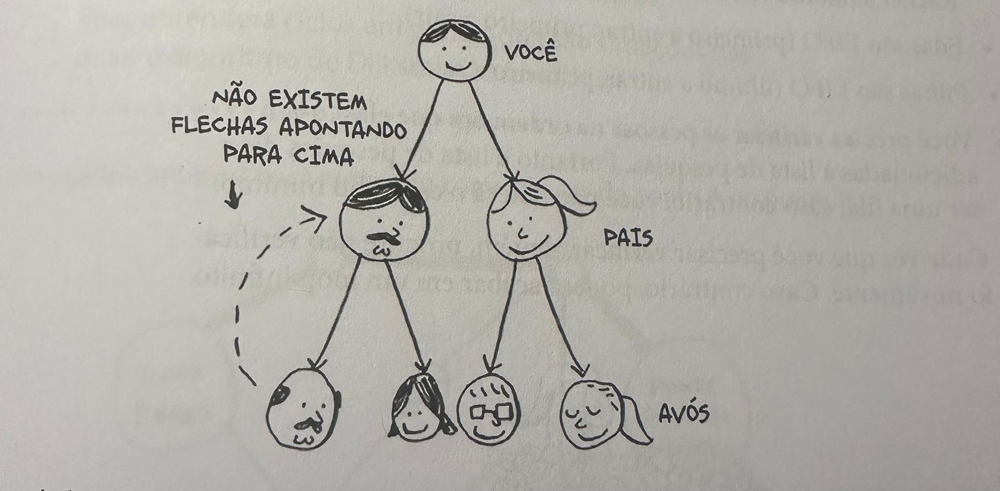

### Exercicios

Este é um pequeno grafo da minha rotina matinal.

Ele mostra que não posso tomar café da manhã antes de escovar meus dentes. Então "tomar café da manhã" depende de "escovar os dentes".
Por outro lado, tomar banho não depende de escovar os dentes, pois posso tomar banho antes de escovar os dentes. A partir desse grafo você pode fazer uma lista relacionando a ordem das atividades da minha rotina matinal.

1. Acordar.
2. Tomar banho.
3. Escovar os dentes.
4. Tomar café da manhã.

Note que "tomar banho" pode ser movido, logo essa lista também é válida:

1. Acordar.
2. Escovar os dentes.
3. Tomar banho.
4. Tomar café da manha.

---

Quanto a estas três listas, marque se elas são válidas ou inválidas.

A.
1. ACORDAR
2. TOMAR BANHO
3. ⁠TOMAR CAFÉ DA MANHÃ
4. ESCOVAR OS DENTES

B.
1. ACORDAR
2. ESCOVAR OS DENTES
3. TOMAR CAFÉ DA MANHÃ
4. TOMAR BANHO

C.
1. TOMAR BANHO
2. ACORDAR
3. ESCOVAR OS DENTES
4. TOMAR CAFÉ DA MA

Resposta: 
tabela A inválida, pois não é possível tomar café da manhã antes de escovar os dentes.
tabela B válida.
tabela C inválida, pois é necessário acordar antes de tomar banho.

---

Aqui temos um grafo maior. Faça uma lista válida para ele.

Resposta: 
1. Acordar
2. Praticar Exercício
3. Tomar Banho
4. Trocar de roupa
5. Escovar os dentes
6. Tomar café da manhã
7. Embrulhar o lanche

---

Você poderia dizer que essa lista é, de certa forma, ordenada. Se a tarefa A depende da tarefa B, a tarefa A aparece depois na lista. Isso é chamado de ordenação topológica, e é uma maneira de criar uma lista ordenada a partir de um grafo. Imagine que você esteja planejando um casamento e tenha um grafo enorme de tarefas a serem realizadas.

Porém voce não sabe nem por onde cefaleçar. Assim, uma ordenação topológica do grato poderia ser feita e, dessa forma, uma lista de tarefas já em ordem seria elaborada.

Suponha que você tenha uma árvore genealógica.

Esta árvore é um grafo, pois existem vértices (as pessoas) e arestas, e as arestas apontam para os pais dos vértices. Porém todas as arestas apontam para baixo, pois não faria sentido uma árvore genealógica ter arestas apontando para cima! Seu pai não pode ser o pai do seu avô!

Isso é chamado de arvore. Uma árvore é um tipo especial de grafo em que nenhuma aresta jamais aponta de volta.

---

Quais desses grafos também são árvores?

Resposta: A e C.