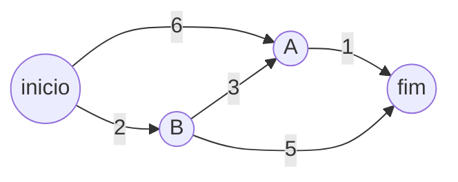

### Problema

No estudo inicial de grafos e pesquisa em largura, estudamos o problema do caminho mínimo onde analisamos o menor caminho possível até um determinado vértice objetivo, mas não tinhamos mais nenhum porém, bastava descobrirmos o menor caminho por número de vértice e tudo estava resolvido, mas e se o caminho com menor número de vértices tiver um custo maior que o caminho com um pouco mais de vértices ?

Imagine que o caminho com menor número de vértices tenha um custo de tempo maior por arestas. Se estivermos de carro e tivermos um caminho para o nosso destino que em tese é menor, mas está com trânsito absurdo, em contra-partida o nosso caminho mais distante do objetivo está com o caminho livre, pode ser que o tempo para chegar no nosso objetivo seja menor usando o maior caminho. Chamamos isso de peso da aresta e o grafo com esses pesos é dito grafo ponderado, as vezes o peso elevado nas arestas do menor caminho faz com que outro caminho maior seja a melhor decisão, mas nosso algoritmo de pesquisa em largura não consegue lidar com isso. E agora ?

---

### Algoritmo de Dijkstra

Utilizaremos o algoritmo de Dijkstra para ir do vértice inicial para o vértice objetivo no menor tempo possível.

Esse algoritmo consiste de 4 etapas:

1) A partir do vértice de origem encontre o próximo vértice onde o custo de sua aresta seja o menor.

2) A partir desse vértice que tem a aresta de menor custo, recalcule o custo para os vizinhos dele.

3) Repita isso para os próximos vértice até que atinja o vértice objetivo.

4) Calcule o caminho final.

---

### Execução do algoritmo

#### Grafo



#### Etapa 1 – análise inicial

Devemos criar uma tabela com todos os vértices disponíveis em nosso grafo e associar seu custo e seu pai, caso não tenha sido analisado aquele vértice ainda deve ser marcado o custo como infinito e o pai indefinido.

Você está no ponto inicial e analisa os vizinhos `A` e `B`.  
- Custo até `A`: **6**  
- Custo até `B`: **2**

Tabela inicial:

| **VÉRTICE** | **CUSTO** | **PAI** |
|:-----------:|:---------:|:-------:|
| A | 6 | inicio |
| B | 2 | inicio |
| fim | ∞ | indefinido |

---

#### Etapa 2 – vizinhos de B

O vértice com **menor custo** é `B (2)`.  
Recalculando custos a partir dele:

| **VÉRTICE** | **CUSTO** | **PAI** |
|:-----------:|:---------:|:-------:|
| A | ~~6~~ → **5** | ~~inicio~~ → **B** |
| B | 2 | inicio |
| fim | **7** | **B** |

---

#### Etapa 3 – vizinhos de A

Agora o menor custo é `A (5)`.  
Recalculando a partir de `A`:

| **VÉRTICE** | **CUSTO** | **PAI** |
|:-----------:|:---------:|:-------:|
| A | 5 | B |
| B | 2 | inicio |
| fim | ~~7~~ → **6** | ~~B~~ → **A** |

---

#### Caminho final

Quando o próximo vértice com menor custo a ser analisado é o vértice final a execução do algoritmo acaba.

Caminho reconstruído a partir dos pais:

```
inicio → B → A → fim
```

Custo total: **6**

> 💡 **Observação:**  
> A *pesquisa em largura (BFS)* encontraria o caminho com menos arestas, mas não o mais econômico em custo total.  
> O Dijkstra, ao considerar os pesos, encontra o caminho ótimo de custo 6.

---

### Ciclo em grafos

Quando adicionamos ciclos a um grafo direcionado, isso serve apenas para nos gerar mais custo, independente da formatação do grafo, o custo de ir até um vértice A, voltar para o vértice B e voltar para o vértice A novamente foi uma operação que adicionou uma complexidade a mais.

No capítulo anterior vimos a questão de grafos direcionados e grafos não direcionados, os direcionados só terão ciclos de forma explicita, pois cada a aresta desse grafo não será mão dupla, então terão que ter 2 arestas com setas para indicar o ciclo de um vértice a outro, já o grafo não direcionado faz com que cada vértice seja mão dupla, virando assim um ciclo. Todo grafo não direciona tem ciclos.

O algoritmo de Dijkstra só funciona em grafos sem ciclos ou em grafos de ciclo positivo. 

### Arestas negativas

Imagina que no exemplo anterior para ir de B até A o custo fosse de -3, isso faria com que o custo para sair de inicio até A passando por B fosse: 2 - 3 = -1, ou seja seria ainda melhor esse caminho, porém arestas com pesos negativos estragam o algoritmo de Dijkstra. Para esses casos a melhor alternativa que é o algoritmo de Bellman-ford que não será abordado no livro de estudo.
