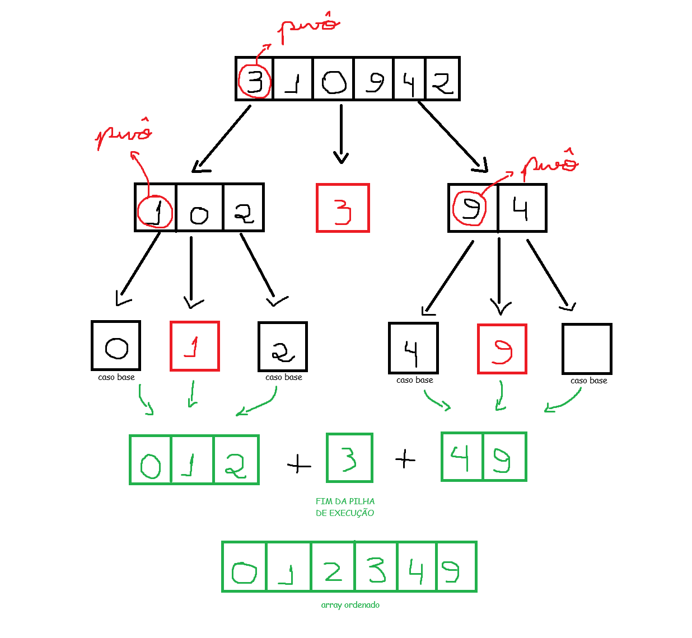

### Quicksort

O algoritmo **Quicksort** utiliza a estratégia de **divisão e conquista**, onde o **caso base** é o array vazio e o array com apenas um elemento, visto que estes já estão ordenados.  

O Quicksort utiliza um elemento **pivô** para que possamos aplicar a DC (*Dividir e Conquistar*). Ao escolher um elemento que será o pivô nesse array, percorremos o array e **separamos em dois novos arrays**:

- O primeiro array com elementos **menores** que o pivô.  
- O segundo array com elementos **maiores** que o pivô.  

Porém, esses dois arrays não estão ordenados — só possuem os elementos maiores ou menores que o pivô, porém fora de ordem.  
Repetimos o processo para os outros dois arrays, selecionando um novo pivô dentro de cada um até que possuam apenas um ou nenhum elemento em uma nova partição.

Abaixo está exibido um **fluxo de execução** do Quicksort com a escolha do pivô sempre no **primeiro elemento** do array:



---

### Performance

O Quicksort tem, em seu **pior caso**, a complexidade **O(n²)** e, em seu **caso médio**, possui **O(n * log n)**.  
Há um outro algoritmo de ordenação famoso, o **Merge Sort**, que em todos os casos possui complexidade **O(n * log n)**.  

Então, por que utilizar o Quicksort ao invés do Merge Sort?

---

## Fator constante

Imagine uma função que faça a **impressão de todos os elementos do array** na tela:

```java
public void imprimir(int[] array) {
    for(int i = 0; i < array.length; i++) {
        System.out.println(array[i]);
    }
}
```

Esse algoritmo terá tempo de execução **O(n)**, porém o que acontece se tivermos um **atraso antes de cada iteração**?

```java
public void imprimir2(int[] array) {
    for(int i = 0; i < array.length; i++) {
        try {
            Thread.sleep(1000); // pausa por 1 segundo
        } catch (InterruptedException e) {
            System.out.println("Thread interrompida!");
        }
        System.out.println(array[i]);
    }
}
```

Ambos os algoritmos terão tempo de execução **O(n)**, mas qual devemos escolher?  
Obviamente a **primeira**, visto que não teremos que esperar 1 segundo para exibir o elemento do array.

Quando escrevemos **O(n)**, estamos querendo dizer isso:  
**C * n**, sendo **C** alguma quantidade de tempo em que o algoritmo leva para ser executado.  

`C = constante`, podendo ser 10ms para a primeira função e 1000ms para a segunda função.  

Normalmente a constante é ignorada, visto que o fator `n` é o que mais impacta no tempo de execução do algoritmo para os piores casos.

---

### Comparando pesquisas

Sabemos que a **pesquisa simples** é de tempo de execução **O(n)** e a **pesquisa binária** é **O(log n)**.  

Vamos supor que executemos esses dois algoritmos em uma **máquina mais rápida** e em uma **máquina mais lenta**, respectivamente:

- Na máquina rápida: cada operação da pesquisa simples leva **10ms**.  
- Na máquina lenta: a pesquisa binária leva **1000ms** por operação.  

Temos então:

```
pesquisa simples: 10ms * n
pesquisa binária: 1000ms * log n
```

Para poucos elementos, como 10:

```
pesquisa simples: 10ms * 10 = 100ms
pesquisa binária: 1000ms * log 10 = 3.321,9ms
```

Mas para **4 bilhões de elementos**:

```
pesquisa simples: 10ms * 4b = 463 dias
pesquisa binária: 1000ms * log 4b = 32 segundos
```

Uma grande diferença.  
Logo, é perceptível que para números grandes de elementos a constante acaba se tornando irrelevante.

Porém, às vezes pode sim se tornar relevante — como no caso do **Quicksort comparado ao Merge Sort**.

---

### QuickSort vs Merge Sort

A **constante do Quicksort** é menor que a do Merge Sort.  
Assim, como ambos são considerados tempos de execução **O(n * log n)**, o Quicksort leva vantagem.  

Apesar do seu pior caso **O(n²)**, ele funciona na grande maioria das vezes no **caso médio**.

---

### Pior caso e caso médio

Se nós escolhermos o pivô sempre como o **primeiro elemento** e o array já estiver ordenado, acabamos caindo no **pior caso**, visto que o primeiro array da partição sempre terá tamanho vazio e o segundo array sempre terá o resto do array.  
A pilha de execução do segundo array sempre será muito longa, chegando na complexidade **O(n²)**.

Se nós escolhermos o pivô sempre na **metade do array**, conseguimos chegar ao **melhor caso**, mesmo ele já estando ordenado.

No pior caso, o tamanho da **pilha de execução** é **O(n)** e, no melhor caso, **O(log n)**.  
Para evitarmos piores casos, a melhor estratégia é escolher o **pivô de forma randômica**.

---

### Análise da pilha de execução

Após analisar o tamanho da pilha, podemos observar **quantas operações são executadas em cada nível**.  
Quando selecionamos um pivô, temos que percorrer todos os elementos do array para fazer a partição, logo o tempo de execução é **O(n)**.  

Podemos então concluir que, para cada nível da pilha, são executadas `n` operações.  
Como a pilha tem em média **log n**, chegamos à seguinte conclusão sobre o tempo de execução do algoritmo:

```
O(n) * O(log n) = O(n * log n)
```

Já no pior caso temos:

```
O(n) * O(n) = O(n²)
```

E para o Quicksort, o **caso médio é sempre o melhor caso**, logo a pilha de execução para pivôs randômicos sempre nos gera **O(log n)** níveis.
